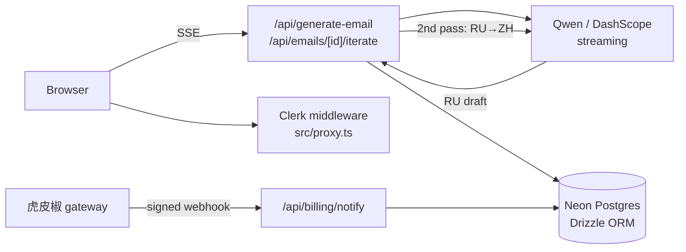

# RCmail — AI 中俄商务邮件助手

RCmail turns a short Chinese description of what you want to say into a ready-to-send
Russian business email, then lets you refine it through multi-turn natural-language
instructions. Every draft comes back with a Chinese translation side by side, so the
sender can verify the tone and content of a language they may not read.

Built for Chinese exporters and trade teams who correspond with Russian-speaking clients
and need correct Russian business etiquette (敬语 forms, 父称 address, formal closings)
without hiring a translator for routine mail.

**Stack:** Next.js 16 (App Router) · React 19 · TypeScript · Drizzle ORM + Neon Postgres ·
Clerk auth · Qwen (DashScope) · Tailwind CSS 4 · deployed on Vercel

---

## Features

| | |
|---|---|
| **5 business mail types** | 展会邀请 · 客户跟进 · 合作洽谈 · 售后管理 · 催款提醒 — each with a task-specific prompt |
| **Tone control** | formal / friendly / firm, applied within Russian business-etiquette constraints |
| **Streaming generation** | Drafts stream token-by-token over SSE instead of blocking on the full response |
| **Multi-turn refinement** | "语气更正式", "精简第一段", "补充联系方式" — incremental edits that keep thread context |
| **Version diff** | Word-level diff highlights exactly what each revision changed before you accept it |
| **Bilingual output** | Every Russian draft is paired with a Chinese translation of the same text |
| **History** | Threads and every revision are persisted per user |
| **Plans & billing** | 5 free generations, then monthly / yearly Business via 虎皮椒 (WeChat / Alipay) |
| **Admin dashboard** | Usage metrics, latency, per-user plan management behind an email allowlist |

### Anti-hallucination prompting

The system prompt hard-bans inventing specifics — dates, booth numbers, invoice numbers,
amounts, contact details. Where the user gave no value, the model must use a generic
formulation (`в удобное для Вас время`) or omit the line entirely, never a `[placeholder]`.
This matters commercially: a fabricated booth number in a client-facing email is worse
than a vague one.

---

## Architecture



Generation is a two-pass pipeline: the Russian draft streams to the client first, then a
second non-streaming call translates the finished draft to Chinese. The user sees output
immediately rather than waiting on both passes.

### Data model

| Table | Purpose |
|---|---|
| `emails` | One row per email thread — subject, recipient, tone, RU output, ZH input |
| `email_messages` | Per-turn thread history (initial request, revision requests, drafts) |
| `user_plans` | Plan type, variant, expiry, free-tier usage counter |
| `processed_payments` | Payment idempotency keys — one row per settled order |
| `analytics_events` | Route-level events, status codes, latency |

### Notable implementation details

- **Free-tier quota is reserved atomically before generation**, not incremented after.
  A conditional `UPDATE ... WHERE trial_used < limit` makes the check-and-decrement a
  single statement, so concurrent requests can't each read a stale counter and slip past
  the limit. Failed generations refund the reserved slot.
- **Payment webhooks are idempotent.** A signed callback is valid forever, so signature
  verification alone doesn't stop a replayed request from repeatedly extending a
  subscription. Orders are claimed by primary key in `processed_payments` first; a
  duplicate claim short-circuits.
- **Renewals extend from the later of `now` and the current expiry**, so renewing early
  never discards paid time.
- **Ownership is enforced in the query**, not after it — every email read/write filters on
  `(id, userId)` together rather than fetching by id and checking afterwards.
- **Webhook signatures use a constant-time comparison.**

---

## Getting started

**Prerequisites:** Node.js 20+, a Neon (or any Postgres) database, a Clerk application,
and a DashScope API key.

```bash
git clone https://github.com/HelloBryte/RCmail.git
cd RCmail
npm install
cp .env.example .env.local   # then fill in the values
npm run db:push              # create tables from the Drizzle schema
npm run dev
```

Open http://localhost:3000.

Billing and the admin dashboard are optional — leave the 虎皮椒 and `ADMIN_EMAILS`
variables unset and the app runs fine in free-tier mode. See [.env.example](.env.example)
for what each variable does.

### Scripts

```bash
npm run dev          # dev server
npm run build        # production build
npm run start        # serve the production build
npm run lint         # eslint
npm run db:push      # push schema changes to the database
npm run db:generate  # generate SQL migrations
```

---

## Deployment

Deployed on Vercel. Two things to set up beyond the environment variables:

1. Point the 虎皮椒 notify URL at `https://<your-domain>/api/billing/notify`.
   It must be publicly reachable — it's the only route exempted from auth in
   [`src/proxy.ts`](src/proxy.ts).
2. Run `npm run db:push` against the production database before the first deploy.

Generation routes declare `maxDuration = 60` for the streaming LLM calls.

---

## Project layout

```
src/
├── app/
│   ├── (auth)/            Clerk sign-in / sign-up
│   ├── (protected)/       dashboard, compose, history, pricing, checkout, admin
│   └── api/               generation, threads, billing, admin
├── components/            history list, diff view, promo countdown
├── lib/
│   ├── db/                Drizzle schema and connection
│   ├── analytics/         best-effort event tracking (never blocks a request)
│   ├── prompts.ts         system + per-mail-type prompts
│   ├── qwen.ts            DashScope client, SSE parsing, subject/body split
│   ├── mail-types.ts      the 5 mail-type slugs, titles, summaries
│   ├── email-thread.ts    thread/message shaping for the compose + iterate flow
│   ├── plans.ts           plan resolution, quota reservation, expiry math
│   ├── hupijiao.ts        payment gateway signing and verification
│   └── text-diff.ts       word-level diff for the revision view
└── proxy.ts               Clerk route protection (Next.js 16 middleware)
```

## License

Not currently licensed for reuse. Please open an issue if you'd like to use any of it.
